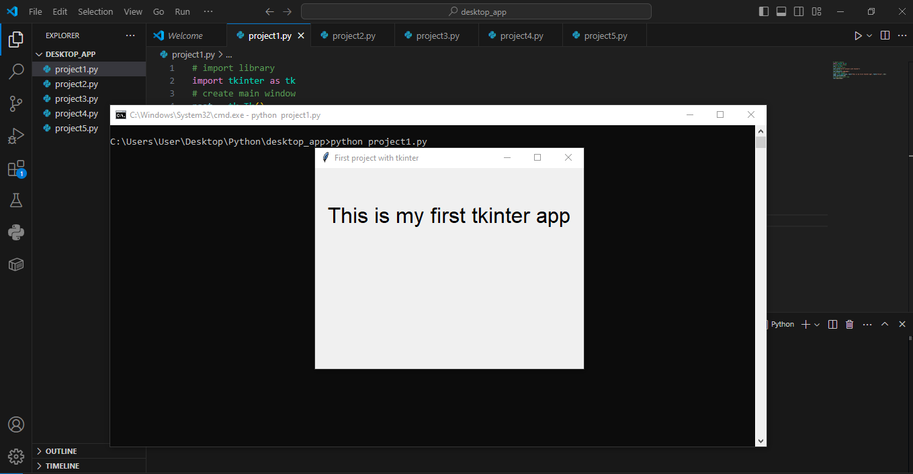
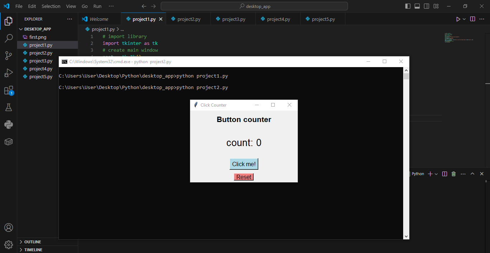
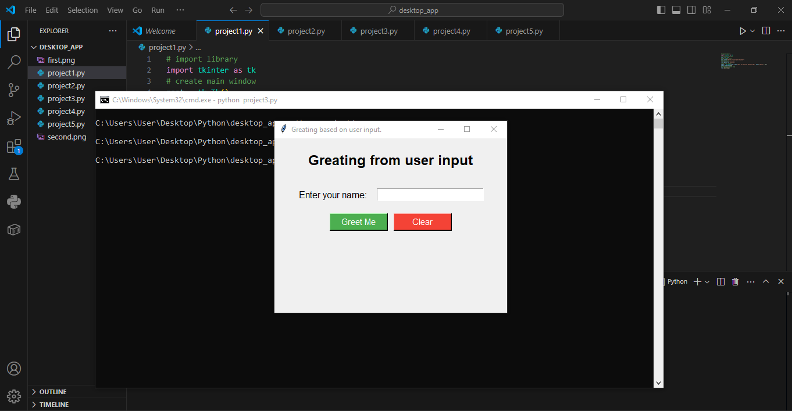
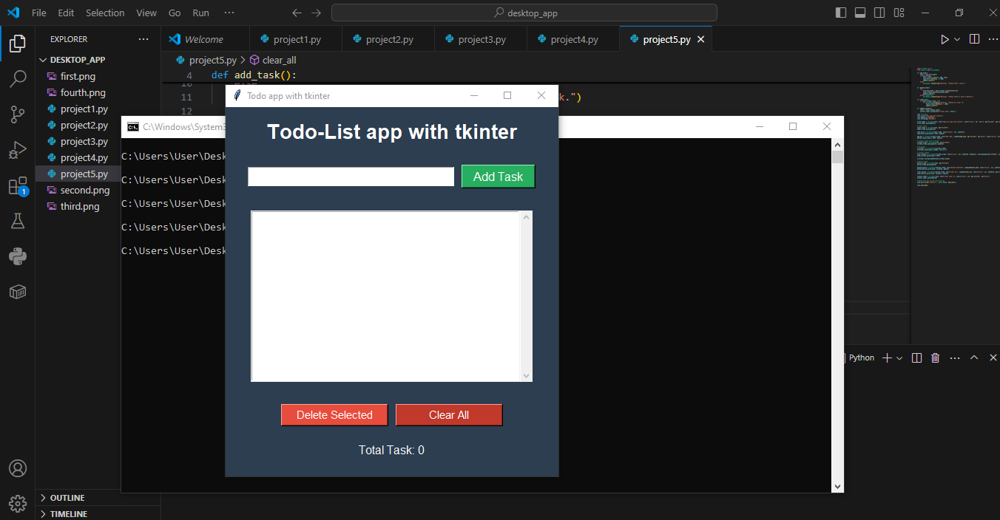

# Python Projects

This repository contains **five beginner-friendly Python Tkinter projects**.  
Each project includes a description, features, how to run, and space to add screenshots or images.

# Programing language is python using Tkinter library.

---

## Project List

---
## Project 1 – Hello world App with Tkinter

### Description
A simple intro to tkinter program that  Prints Hello world.

### Features
- Print Simple text

### Screenshot
 

## Project 2 – Counter App with Tkinter

### Description
A simple Conuter program that performs increment of counter and reset it.

### Features
- Icrement a counter
- Reset the counter 

### Screenshot
 

## Project 3 – Greating App with Tkinter

### Description
A simple greating program that allows user to enter their name and it generates a greating using their name.

### Features
- Input 
- Generata greating 

### Screenshot
 

## Project 4 – Calculator App with Tkinter

### Description
A simple calculator program that performs basic arithmetic operations.

### Features
- Addition  
- Subtraction  
- Multiplication  
- Division  
- Error handling  

### Screenshot
 

## Project 5 – Todo App with Tkinter

### Description
A simple Tkinter Todo program that performs four CRUDE (Create, retrieve, update and delete) functions.

### Features
- Add Task 
- Update Task  
- Delete tAsk
- Retrieve task  
- Error handling  

### Screenshot
 


## Requirements

Only Python 3 is required. 

## Running Any Project

Open a terminal inside the project folder and run:

### Run
```
python project1.py
python project2.py
python project3.py
python project4.py
python project5.py

```